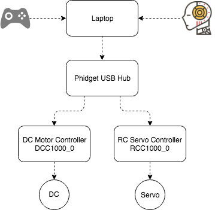
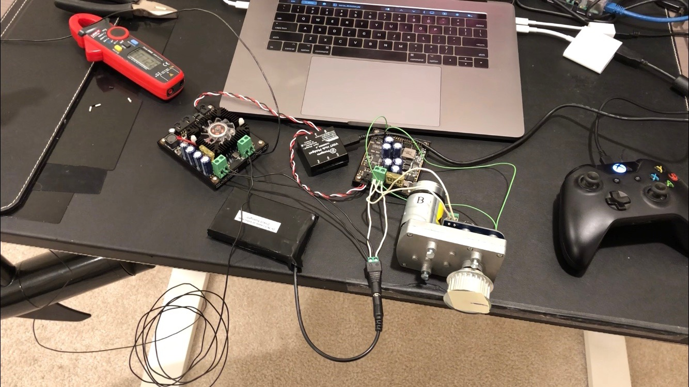

# Propulsion and Steering Control Demo

In this article, we'll demonstrate the propulsion and steering control system used by DeepNav autonomous driving boat.

## The basic idea

We aim to build the control system that:

1. Modulate the propulsion from a DC motor and the angle of the steering from a servo motor.
1. Control command can be issued from either a AI program or a human driver with a joystick.
1. Human driver can take over the control from AI at anytime.

## Components

1. A laptop
    - Listens control command from Joystick or AI program
    - Runs control logics
    - Issues control command to Phidgets controllers

1. Xbox one Joystick: Human control input
1. [Phidget hub](https://www.phidgets.com/?tier=3&catid=2&pcid=1&prodid=643): Connects DC motor controller and Servo motor controller
1. Dc Motor:
    - Provides propulsion
    - [36lb Thrust Electric Trolling Motor by Newport Vessels](https://www.amazon.com/Newport-Vessels-Saltwater-Electric-Trolling/dp/B00VYP3R82/ref=sr_1_2_sspa?s=boating-water-sports&ie=UTF8&qid=1529959953&sr=1-2-spons&keywords=trolling+motor&psc=1)

1. [Dc motor controller](https://www.phidgets.com/?tier=3&catid=18&pcid=15&prodid=965)

1. Servo Motor:
    - Steers the boat
    - [ASMC-04B Large torque alloy steering gear](https://www.ebay.com/itm/ASMC-04B-Large-torque-alloy-steering-gear-12V-24V-180kg-cm-Large-robot-arm/302426072650?ssPageName=STRK%3AMEBIDX%3AIT&_trksid=p2060353.m2749.l2649)

1. [Servo Controller](https://www.phidgets.com/?tier=3&catid=21&pcid=18&prodid=1015)

## System Diagram



## Our Setup and Demo video

[](https://youtu.be/04RkUX4lYTs)

## Preparing

1. Properly config the joystick

    Please follow [this](https://newatlas.com/how-to-use-xbox-one-controller-mac/47159/) articel to config the joystick.

    As we are using a bit old version of the controller, we connected the controller with a USB cabel, installed the driver and software from [here](https://github.com/360Controller/360Controller/)

1. Install Phidget driver and software

    Please follow [this articel](https://www.phidgets.com/docs/Software_Overview) to install Phidget.

1. Install pygame: To get control command from joystick

    ``` bash
    pip install pygame
    ```

1. Wire them

    - Plug or pair (wireless controller) Joystick to your laptop.
    - Connect Phidget Hub to laptop's USB port.
    - Connect DC motor controller to Phidget Hub's port 0.
    - Connect Servo motor controller to Phidget Hub's port 1.
    - Connect DC power (12V) to both controller's power source terminal.
    - Connect Servo motor to Servo controller's pin 15 and DC power.
    - Connect DC motor's black wire to DC motor controller's power output "-" terminal, white, yellow and red wire to controller's "+" terminal.

1. Use Phidget control panel to test if DC motor and Servo motor works

    - Now you should be able to see 2 devices connect to Phidgets hub at port 0 and 1.
    - Test DC motor
        - Double click the DC motor Phidget's DC motor controller controller to open the control panel
        - Slide to change the value of "Target Velocity" to see if the DC motor start to rotate.
    - Test Servo motor
        - Double click the "16x RC motor Phidget"'s RC servo motor controller at channel 15 to open the control panel
        - change "Min PulseWidth" to 500 μs
        - change "Max Pulse Width" to 2500 μs
        - Click on the "Engage" button
        - Slide "target position" to see if the servo rotates.

## Roll the Demo

``` bash
python control_system_demo.py
```

### What to expect in this demo

1. The left knob is used as steering wheel, when you move the left knob left and right, servo will rotate correspondingly

1. The right trigger is used as throttle paddle, when you pull the right trigger, the DC motor will continuously rev, the deep you pull the trigger, the faster the motor revs

1. The right knob is used as going forward and backward switch. When you pull the right knob downward and release, the motor will rev in the other direction; when you push the knob upwards, the motor rev direction restores.

1. The "X" button is used as AI mode and manual mode toggler. Pressing it change the system mode to "AI" mode, which let the servo sweeps back and forth. The DC motor revs from slow to fast. Pressing it again will turn the mode back to manual mode again. Please note that: the AI mode is not really running a AI program to generate the control command, this is just a demonstration of ability to switch modes.