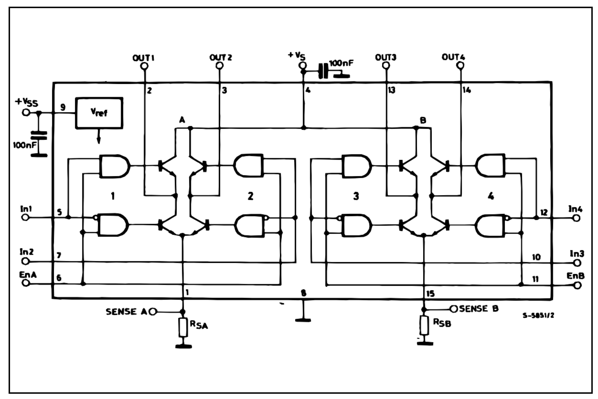
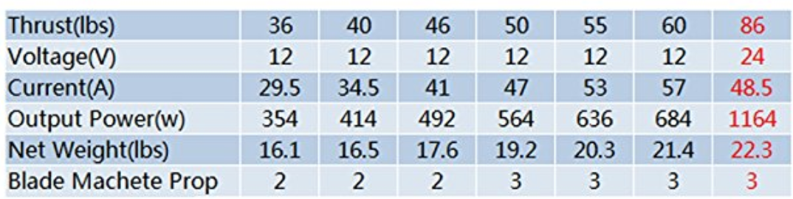
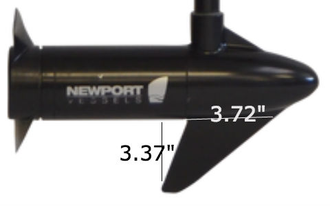

# DeepNavigation

## Choose PVC Pipes

When people are talking about the diameter of PVC pipe, they mean the inner diameter (ID) instead of OD. [This article](https://www.pvcfittingsonline.com/resource-center/pvc-pipe-od-size-chart/) provides the mapping from the inner diameter (ID) to the outer diameter (OD) of PVC pipes: 


Deriving from data in the above table, we can compute the ratio of thickness over ID:

| ID   |  OD   | thickness | thickness / ID |
|------|-------|-----------|----------------|
| 0.5  | 0.84  | 0.34      | 0.68           |
| 0.75 | 1.05  | 0.3       | 0.4            |
| 1    | 1.315 | 0.315     | 0.315          |
| 1.25 | 1.66  | 0.41      | 0.328          |
| 1.5  | 1.9   | 0.4       | 0.266667       |
| 2    | 2.375 | 0.375     | 0.1875         |
| 3    | 3.5   | 0.5       | 0.166667       |

It seems that PVC pipes with ID=1.24 and 1.5 are the thickest (and supposedly strongest).

## Controlling DC Motors

Most servo motors can rotate for 180 degrees, so we’d prefer to control the DC motors for both clockwise and counterclockwise directions.

The control circuit for both directions is known as [H-bridge](http://www.modularcircuits.com/blog/articles/h-bridge-secrets/h-bridges-the-basics/), which works ad follows:


If Q1 and Q4 close but Q3 and Q2 open, the current flows through the DC motor from left to right.  If Q3 and Q2 close but Q1 and Q4 open, the current flows from right to left and the motor rotates in the opposite direction.

If both Q1 and Q2 close (or, Q3 and Q4 close), there would be a short circuit.

To prevent such illegal combinations, we can add two more transistors as the following:


The above configuration cannot adjust the power of the DC. To do PWM of power, we can add an ENABLE signal, which is a 1.5V waveform. ICs like [L298](https://www.sparkfun.com/datasheets/Robotics/L298_H_Bridge.pdf) implements this method:



## Battery

We have two Renogy RNG-BATT-GEL12-100 Deep Cycle [Pure Gel Batteries](https://www.amazon.com/gp/product/B01KN6QUW2/ref=oh_aui_detailpage_o00_s00?ie=UTF8&psc=1), each provide 12V and 100Ah capacity.

Lead-acid batteries should discard in no less than 5 hours, as fast discard might damad them. Suppose that we are going to discard a 60Ah battery in 5 hours, then the currency should be 100Ah / 5h = 20A.

Our [36 lbs DC motor](https://www.amazon.com/gp/product/B0713ZRFCC/ref=oh_aui_detailpage_o01_s00?ie=UTF8&psc=1) requires 29.5A current, as listed in the following table, so we need two batteries.



## Control Servo Motor Using Arduino

Here is a [good comparison](http://bioeng.nus.edu.sg/mm/wp-content/uploads/2012/07/MotorControl-1japwem.pdf) between servo motors and stepper motors.

- A servo motor includes a sensor, usually, a [potentiometer](https://en.wikipedia.org/wiki/Potentiometer), which is a three-terminal resistor with a sliding or rotating contact that forms an adjustable voltage divider.  This sensor helps the servo hold its position even if external force pushes against it.

- A stepper is a circle of electromagnets -- by activating a certain one, the shaft moves towards (and ideally very close to) the electromagnet.

Here is a good [introduction](https://www.digikey.com/en/articles/techzone/2017/mar/servo-motors-and-control-with-arduino-platforms)
to servo motors and Arduino controlling.

### Rudder servo

In order to find a proper way of electrical controlling of the rudder, we looked up for the types of motor and the torque requirement for the rudder.

Looks both servo motor and stepper motor fits, but which one to buy is decided by the torque needed to properly steel the boat and if it can easily work with Arduino.

We found the following formula to decide the torque from [here](http://www.ls-france.com/en/power-assisted-hydraulic-steering-systems/torque-calculation-assist/)

```
C = S x [ (0.4 Lg) – Lc ] x V² x K

C	= Torque in kgm
S	= Total surface of rudder (H x Lg) in sq. m
H	= Height of rudder in m
Lg	= Width of rudder in m
Lc	= Compensation width in m
V	= Maximum speed of the boat in knots
K	= Coefficient in function of total rudder angle

Port to starboard	70°	K = 15.89
Port to starboard	80°	K = 17.80
Port to starboard	90°	K = 19.52

For a boat with a steering nozzle	C x 2.0
For twin engine power boats with 1 rudder	C x 0.5

```


And the rudder size is approximately shown as bellow



So we have the values for above factors:

```
S = 0.004038702
H = 0.042799m (3.37 inch/2)
Lg = 0.047244 (3.72in /2)
Lc = 0
V = 3.04142 (3.5mph)
K = 19.52 (when 90degree)
with steering nozzle, C = C*2
```

as result, we need to find the motor with torque `C = 0.027562 kgm = 2.7kg cm`
