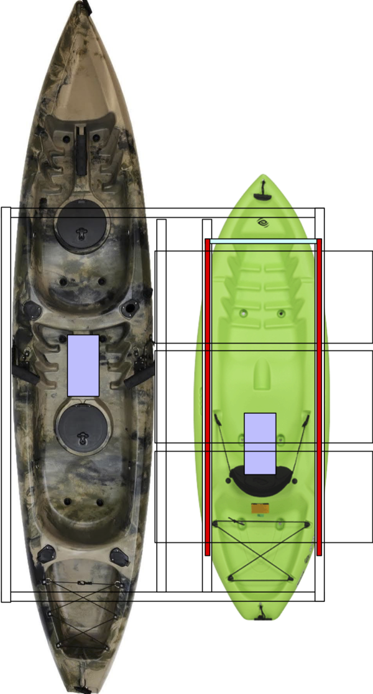

# Structural Design

To bring together two kayaks, we need to build a frame, which is

1. hard enough to handle the separate movement of the two bodies,
2. light enough to ease the insallation by the lake/sea, and
3. small enough to ease the transportation by the truck.

## Metal or PVC

The initial idea was to make the frame of unistrut, which is hard, and could have threaded rods which can be plugged into the holes on the bed of kayaks.  However, after watching a Youtube video that shows a PVC frame, it seems that PVC pipes might be hard enough too.  If so, we'd rather choose PVC pipes for its lightness.

## The Structure

Here follows the overall design

1. The [big kayak](http://a.co/8Lf1xsf) for loading a 60 lbs battery and two persons.
2. The [small kayak](http://a.co/9iSYXVi) for loading 3 to 5 solar panels and a 60 lbs battery.
3. The frame consists of 6 PVC pipes connected by [4-way tees](https://www.homedepot.com/p/Formufit-1-in-Furniture-Grade-PVC-4-Way-Tee-in-White-4-Pack-F0014WT-WH-4/205749309) and [3-way elbows](https://www.homedepot.com/p/Formufit-3-4-in-Furniture-Grade-PVC-3-Way-Elbow-in-White-8-Pack-F0343WE-WH-8/205749438).
4. The frame have some supporters for the engine board (not in the figure) and the solar panel unit. The solar unit supporter must be high enough to save space for the battery beneath it.
5. Each solar panel unit consists of two unistruts and two panels.  Having more panels would make the unit too heavy for one person to move. 

## Choose PVC Pipes

When people are talking about the diameter of PVC pipe, they mean the inner diameter (ID) instead of OD. [This article](https://www.pvcfittingsonline.com/resource-center/pvc-pipe-od-size-chart/) provides the mapping from the inner diameter (ID) to the outer diameter (OD) of PVC pipes: 

Deriving from data in the above table, we can compute the ratio of thickness over ID:

| ID   |  OD   | thickness | thickness / ID |
|------|-------|-----------|----------------|
| 0.5  | 0.84  | 0.34      | 0.68           |
| 0.75 | 1.05  | 0.3       | 0.4            |
| 1    | 1.315 | 0.315     | 0.315          |
| 1.25 | 1.66  | 0.41      | 0.328          |
| 1.5  | 1.9   | 0.4       | 0.266667       |
| 2    | 2.375 | 0.375     | 0.1875         |
| 3    | 3.5   | 0.5       | 0.166667       |

It seems that PVC pipes with ID=1.24 and 1.5 are the thickest (and supposedly strongest).
